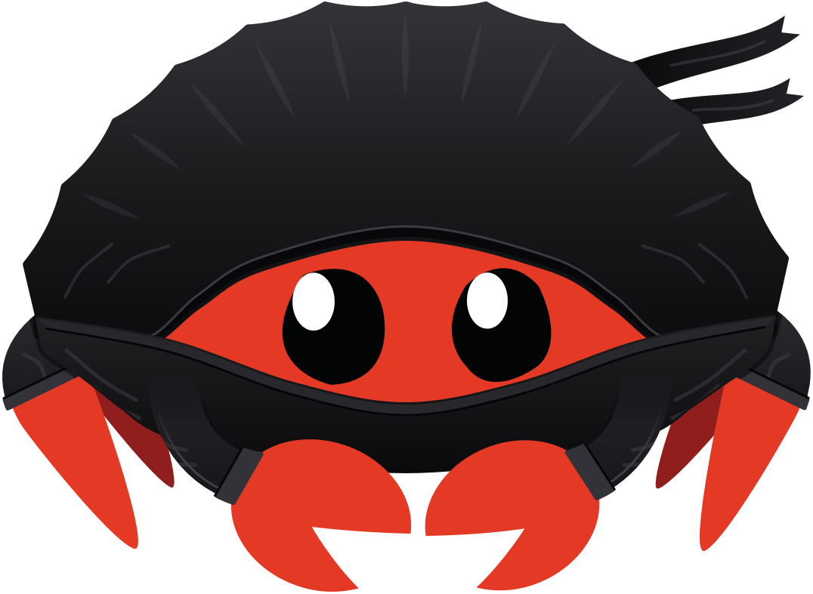

<p align="center">
  <picture>
    <source media="(prefers-color-scheme: dark)" srcset="public/logo-on-dark.svg">
    
  </picture>
</p>

# Oxidō

Oxidō is a project-based remix of Let's Get Rusty's Rust course. The name is *oxide* (rust) plus *-dō*, "the way," as in judo, aikido and kendo. You watch Bogdan's videos on *The Rust Programming Language*, read a matching text lesson, and use each chapter to grow one project: minisql, a small SQL database that starts as a terminal prompt and ends as a multithreaded server.

You take the course in your own browser. Run `oxido` in your minisql folder: it opens the course, keeps your progress, and reruns the current stripe's tests every time you save, a bit like rustlings with a web page. You write minisql in whatever editor you already use. If you only want to read and watch, the same course is on the website, and you don't have to install anything for that. It comes in a light and a dark theme and follows your system setting unless you pick one.

> Not affiliated with or endorsed by Let's Get Rusty. The videos belong to their creator and are embedded from YouTube.

## What you build

```text
$ minisql library.db
db > insert 1 alice alice@example.com
Executed.
db > select where username contains ALI
(1, alice, alice@example.com)
Executed.
db > .exit
```

At black belt, `minisql serve library.db` answers SQL over HTTP from a pool of worker threads.

| Belt | Book chapters | What minisql gains |
|---|---|---|
| White | 1-3 | a `db > ` prompt and meta-commands |
| Yellow | 4-6 | rows, statements, insert and select |
| Orange | 7-9 | modules, an index, errors, saving to disk |
| Green | 10-11 | traits, a borrowing tokenizer, and tests you write first from here on |
| Blue | 12-13 | a real CLI, `WHERE ... CONTAINS`, iterators |
| Purple | 14-15 | a Cargo workspace, a tree index, `Rc`/`Weak`, `Drop` |
| Brown | 16-18 | parallel import, shared sessions, storage backends, transactions |
| Black | 19-20 | advanced traits and macros, then the database server |

Each belt is split into stripes, from 4 to 6 depending on how much the belt covers. A stripe is one small feature with its own tests, so there are 40 steps between your first class and the black belt. The full plan is in [docs/roadmap-course.md](docs/roadmap-course.md).

## How a class works

Each class starts with Bogdan's video, embedded in the page. A text lesson follows with the same teachings in the same order, written fresh with real-world examples.

Some classes end with a quiz. You see your results at the end, with the correct answer shown for anything you missed, and you can skip a quiz or mark it done whenever you like. Questions about code have a small editor, and `oxido` checks your answer with clippy. Each phase ends with a build step: you add a feature to minisql, and when its tests pass you earn the next stripe.

Your progress, your quiz results and the notes you take on video timestamps or paragraphs stay on your machine, in a small SQLite file inside your project's `.oxido/` folder.

## Status

The project is in early development. Platform phase P0 (the foundation) is done. That covers the React app and the `oxido` server with its SQLite store and security checks. [docs/roadmap-platform.md](docs/roadmap-platform.md) lists what comes next. `oxido` isn't on crates.io yet; until then, build it from this repository.

## Development

You need [Rust](https://rustup.rs) and [Bun](https://bun.sh).

```sh
bun install                          # also installs the git hooks
bun run build && cargo run -p oxido -- serve --project dev/sandbox  # the app as students get it
```

For frontend work with hot reload, run `cargo run -p oxido -- serve --dev --no-open --project dev/sandbox` in one terminal and open the link it prints, which starts a session. Then run `bun run dev` in a second terminal and use http://127.0.0.1:5173.

| Task | Command |
|---|---|
| Unit and component tests | `bun run test` |
| End-to-end tests (against `oxido`) | `bun run test:e2e` |
| Type check | `bun run check` |
| Lint and format | `bun run lint` / `bun run lint:fix` |
| Rust tests | `cargo test --workspace` |
| Rust lint | `cargo clippy --workspace --all-targets -- -D warnings` |
| Release build of `oxido` with the UI inside | `bun run build && cargo build --release -p oxido` |

The repository layout, architecture and conventions are described in [docs/](docs/README.md). If you'd like to contribute, start with [CONTRIBUTING.md](CONTRIBUTING.md). Claude reviews every pull request, and CI has to pass before anything merges.

## Credits

- Bogdan Pshonyak of [Let's Get Rusty](https://www.youtube.com/@letsgetrusty), for the video course this project is built around.
- Steve Klabnik, Carol Nichols and the Rust community, for [*The Rust Programming Language*](https://doc.rust-lang.org/book/), which the videos follow.
- Will Crichton and the Cognitive Engineering Lab at Brown University, for [mdbook-quiz](https://github.com/cognitive-engineering-lab/mdbook-quiz). The quizzes use its question format.
- Connor Stack, for [Let's Build a Simple Database](https://github.com/cstack/db_tutorial), and the authors of [*500 Lines or Less*](https://github.com/aosabook/500lines). Both inspired the Mini SQL project.
- The React, React Router, Vite, Tailwind CSS, shadcn/ui, axum, Tokio, SQLite, CodeMirror, Biome, Vitest and Playwright teams, whose open-source work the platform runs on.
- Claude (Anthropic), co-author of the scaffolding, docs and pipelines.
- Felipe Euzébio, author and maintainer.

Every reference used while planning the project is listed in [docs/sources.md](docs/sources.md).

## License

The code and the original text in this repository are released under the [MIT License](LICENSE). The embedded videos aren't part of this repository and remain the property of their creator. *The Rust Programming Language* is licensed under MIT or Apache-2.0.
